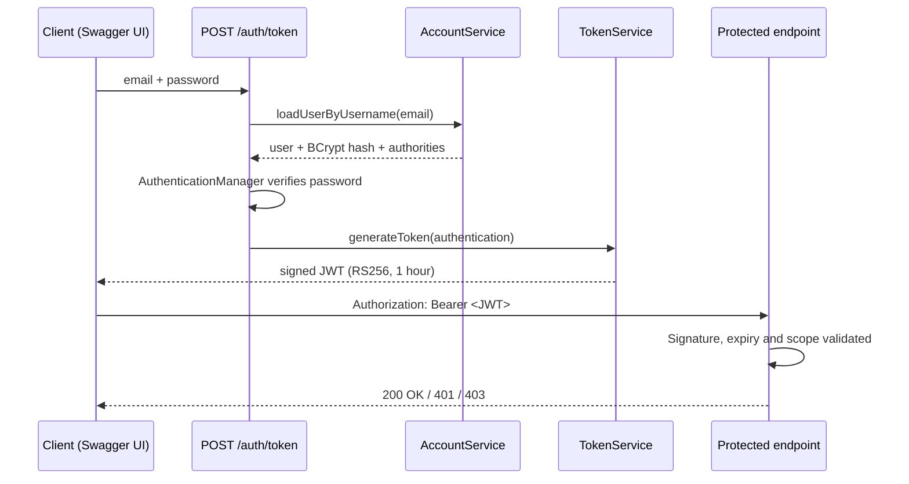

# 📸 Photo Album REST API — Spring Boot, Spring Security & JWT

A stateless REST API built with **Spring Boot 4** where users register, log in, and manage their own private photo albums. Access is protected with **JWT bearer tokens (RS256)** using Spring Security's **OAuth2 Resource Server**, with **role-based authorization** and **per-user data ownership checks**. Fully documented and testable through **Swagger UI**.


<!-- Add a Swagger UI screenshot here, e.g.  -->

---

## 🔐 Security Overview

Security is the core of this project. Here is exactly what is implemented.

### Authentication flow



### What is implemented

| Area | Implementation |
|---|---|
| **Token type** | JWT, signed with **RS256** (RSA 2048-bit key pair) using Nimbus JOSE |
| **Token issuing** | `TokenService` builds claims: `iss`, `iat`, `exp` (1 hour), `sub` (email) and `scope` (the user's authorities) |
| **Token validation** | Spring Security **OAuth2 Resource Server** validates the signature and expiry on every request through a `JwtDecoder` |
| **Password storage** | **BCrypt** hashing via `BCryptPasswordEncoder`. Plain-text passwords are never stored |
| **Session handling** | **Stateless** (`SessionCreationPolicy.STATELESS`). No server-side sessions, and CSRF is disabled because the API does not use cookies |
| **Authorization** | Role-based rules in `SecurityConfig`. Authorities in the token become `SCOPE_ADMIN` and `SCOPE_USER` |
| **Data ownership** | Album and photo endpoints compare the token's user with the album owner and return **403 Forbidden** when they differ |
| **Input validation** | Bean Validation (`@Valid`, `@Email`, `@Size`, `@NotBlank`) on request DTOs |
| **API docs auth** | Swagger UI has an **Authorize** button (HTTP bearer scheme), so protected endpoints can be tested with a real token |

> **A note on "OAuth":** this project uses Spring Security's OAuth2 *Resource Server* support, meaning the API validates signed JWT bearer tokens the way an OAuth2-protected API does. The tokens are issued by the app itself. It is not a standalone OAuth2 Authorization Server and does not include social login.

### Endpoint access rules

| Endpoint | Access |
|---|---|
| `POST /auth/token` | Public. Returns a JWT for valid credentials |
| `POST /auth/users/add` | Public. Registers a new account with the `USER` role |
| `GET /auth/users` | `ADMIN` or `USER` |
| `GET /auth/profile` | Any authenticated user |
| `PUT /auth/users/{id}/update-authorities` | `ADMIN` only |
| `DELETE /auth/profile/delete` | Any authenticated user |
| `/album/**` (all album and photo endpoints) | Authenticated **and** must own the album |
| `/swagger-ui/**`, `/v3/api-docs/**`, `/db-console/**` | Open, for local development only |

---

## ✨ Features

- User registration and login with JWT
- Role-based access control (`USER`, `ADMIN`)
- Create, read, update and delete **albums**
- **Upload multiple photos** to an album (multipart, up to 10 MB)
- **Automatic thumbnail generation** (300 px wide, using imgscalr)
- Download original photos and thumbnails
- Layered architecture: Controller → Service → Repository → JPA entities
- DTO payloads that keep entities out of the API
- Centralized success and error message constants
- File logging with daily rolling (`appLog.log`)
- Spring Boot Actuator included
- Interactive API documentation with **Swagger UI (springdoc-openapi)**

---

## 🧰 Tech Stack

| Layer | Technology |
|---|---|
| Language / Build | Java 17, Maven |
| Framework | Spring Boot 4.1.1 (Web MVC) |
| Security | Spring Security, OAuth2 Resource Server, Nimbus JOSE + JWT |
| Persistence | Spring Data JPA, Hibernate, H2 (file-based) |
| API docs | springdoc-openapi 3.1.0 (Swagger UI) |
| Utilities | Lombok, imgscalr, Bean Validation |

---

## 🚀 Getting Started

**Prerequisites:** JDK 17+ (Maven wrapper included, so Maven is not required).

```bash
git clone https://github.com/<your-username>/<repo-name>.git
cd <repo-name>

# Linux / macOS
./mvnw spring-boot:run

# Windows
mvnw.cmd spring-boot:run
```

The app starts on **http://localhost:8080**.

| URL | Purpose |
|---|---|
| http://localhost:8080/swagger-ui/index.html | Swagger UI |
| http://localhost:8080/v3/api-docs | OpenAPI JSON |
| http://localhost:8080/db-console | H2 console (JDBC URL: `jdbc:h2:file:./db/db`) |

### Try it in Swagger UI

1. Open Swagger UI and call **`POST /auth/token`** with a seeded user:

   ```json
   { "email": "julian@gmail.com", "password": "password" }
   ```

2. Copy the `token` value from the response.
3. Click **Authorize** (top right) and paste the token.
4. Call protected endpoints such as `GET /auth/profile` or `POST /album/albums/add`.

**Seeded demo accounts** (created on startup, demo use only):

| Email | Password | Roles |
|---|---|---|
| `skyler@gmail.com` | `password` | `USER` |
| `julian@gmail.com` | `password` | `ADMIN`, `USER` |

### Example with curl

```bash
TOKEN=$(curl -s -X POST http://localhost:8080/auth/token \
  -H "Content-Type: application/json" \
  -d '{"email":"skyler@gmail.com","password":"password"}' | jq -r .token)

curl -H "Authorization: Bearer $TOKEN" http://localhost:8080/auth/profile
```

---

## 🗂️ Project Structure

```
src/main/java/com/example/springDemoWithRest
├── Controller/     REST controllers (Auth, Album, Home)
├── Service/        Business logic (Account, Album, Photo, Token)
├── Repository/     Spring Data JPA repositories
├── Model/          JPA entities (Account, Album, Photo)
├── Payload/        Request and response DTOs
├── Security/       SecurityConfig, RSA key and JWKS setup
├── config/         OpenAPI definition, seed data
└── util/           Constants and file/thumbnail helpers
```

---

## 🛣️ Roadmap

Planned improvements, tracked honestly:

- [ ] Load the RSA signing key from external config or a secret store so tokens survive restarts (it is currently generated in memory at startup)
- [ ] Refresh tokens and token revocation
- [ ] Return `401` (instead of `400`) for failed logins, plus a global exception handler
- [ ] Restrict `GET /auth/users` to `ADMIN` only
- [ ] Rate limiting / lockout on `/auth/token`
- [ ] Configurable upload directory (currently inside `src/main/resources`)
- [ ] Integration tests with Spring Security Test (`@WithMockUser`, JWT test support)
- [ ] Dockerfile and `docker-compose`
- [ ] GitHub Actions CI (build and test)
- [ ] Optional: OAuth2 login with Google/GitHub, or Spring Authorization Server

---

## 📄 License

Add a license of your choice (MIT is a common default for demo projects).
